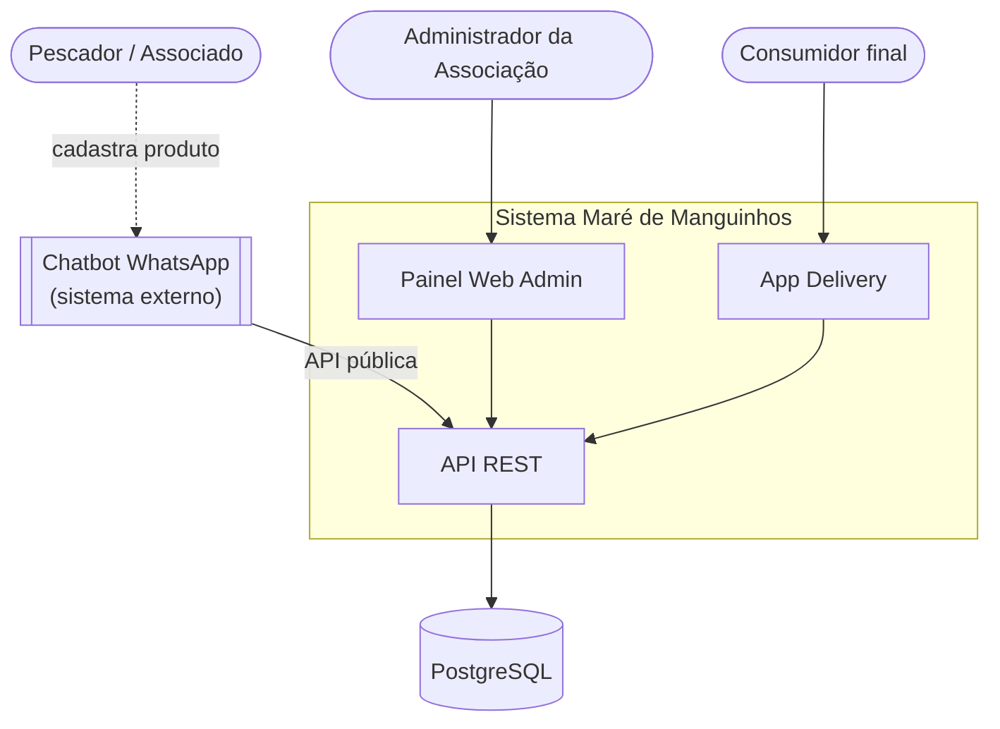
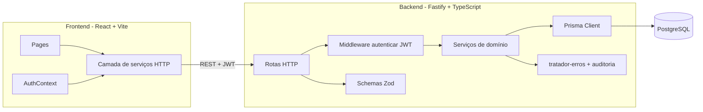
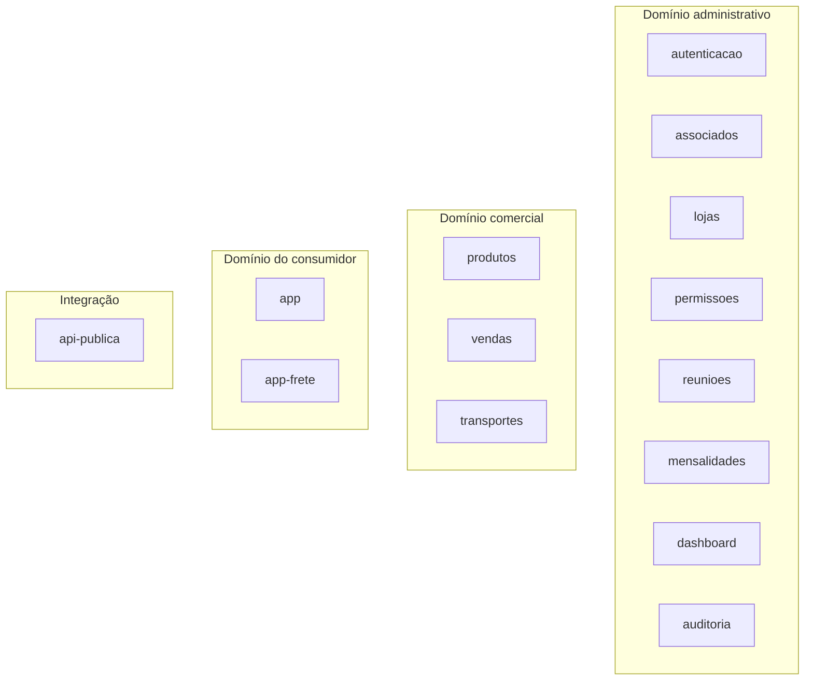
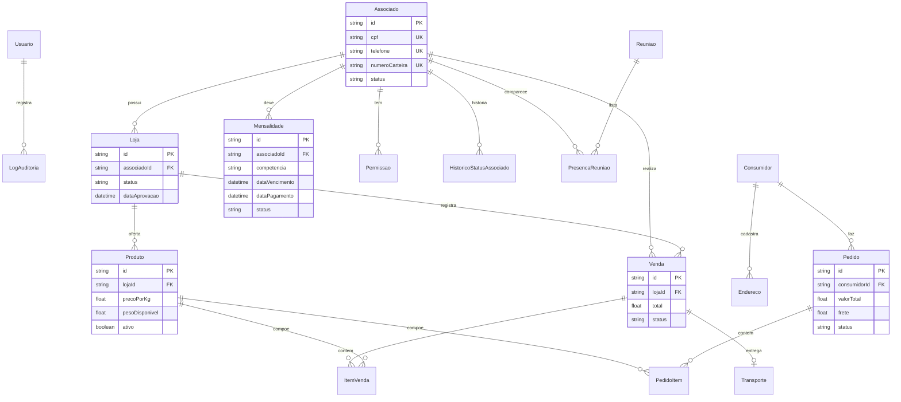
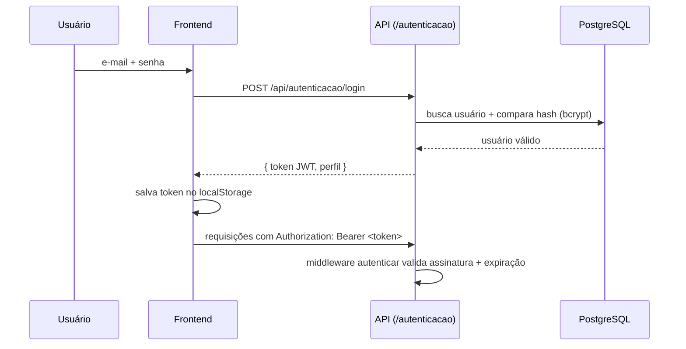
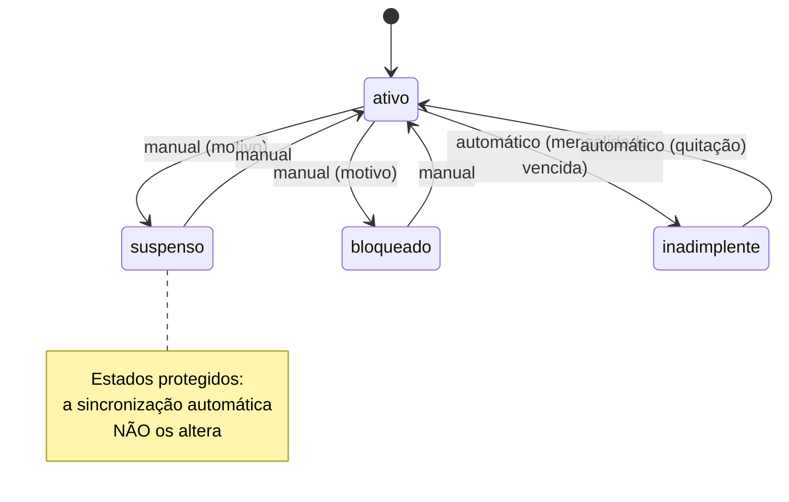
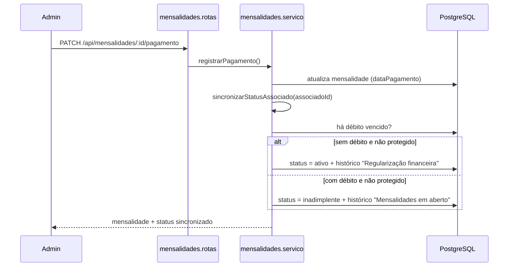
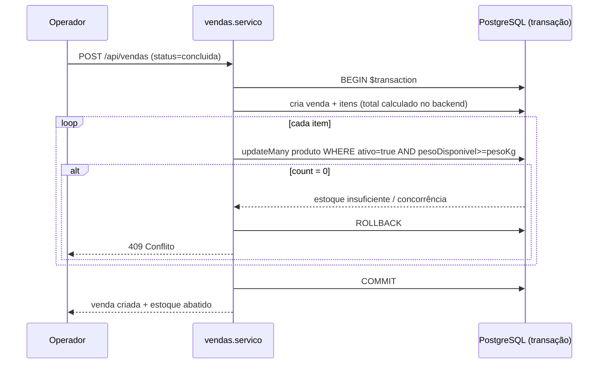
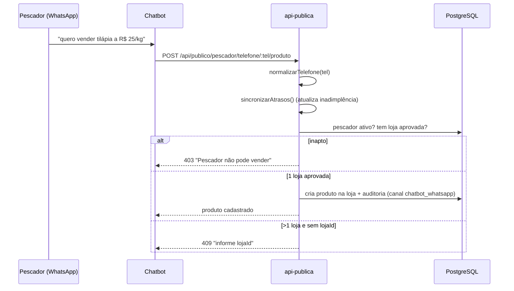

# Arquitetura

Documento técnico da arquitetura do sistema da Associação de Pescadores Maré de Manguinhos.
Cobre visão de alto nível, containers, modelo de dados, fluxos críticos (com diagramas de
sequência) e as decisões arquiteturais que os sustentam.

> As regras de negócio referenciadas aqui são formalizadas via *Spec-Driven Development* em
> [`specs/`](../specs/README.md) (GitHub Spec Kit). Os épicos que as originam estão em
> [`EPICS.md`](EPICS.md).

---

## 1. Visão de contexto (C4 — nível 1)

Quem usa o sistema e com o que ele conversa.



- **Administrador** opera o painel web (gestão completa).
- **Pescador** cadastra produtos via WhatsApp (chatbot → API pública).
- **Consumidor** compra pelo app de delivery.
- **Chatbot** e outros sistemas externos consomem a **API pública** (sem autenticação, dados mínimos).

---

## 2. Containers (C4 — nível 2)



### Stack

| Camada | Tecnologias |
|---|---|
| **Frontend** | React 18, Vite, React Router, TypeScript, Tailwind CSS, shadcn/ui |
| **Backend** | Node.js, TypeScript, Fastify, Prisma ORM, Zod, JWT |
| **Banco** | PostgreSQL |
| **Docs** | MkDocs Material |
| **Testes** | Vitest |
| **SDD** | GitHub Spec Kit (`.specify/`, `specs/`) |

---

## 3. Organização do código

### Backend — módulos de domínio

Cada módulo em `backend/src/modulos/<dominio>/` segue a **tríade** fixa:

- `*.rotas.ts` — protocolo HTTP (Fastify); sem regra de negócio.
- `*.servico.ts` — regras de negócio e persistência (Prisma).
- `*.esquemas.ts` — validação/contrato de entrada (Zod).



Arquivos compartilhados:

- [backend/src/aplicacao.ts](../backend/src/aplicacao.ts) — composição da API.
- [backend/src/middlewares/autenticar.ts](../backend/src/middlewares/autenticar.ts) — proteção por JWT.
- [backend/src/compartilhado/tratador-erros.ts](../backend/src/compartilhado/tratador-erros.ts) — erros centralizados.
- [backend/src/compartilhado/erros.ts](../backend/src/compartilhado/erros.ts) — classes de erro de domínio.
- [backend/src/compartilhado/auditoria.ts](../backend/src/compartilhado/auditoria.ts) — registro de logs.
- [backend/src/compartilhado/telefone.ts](../backend/src/compartilhado/telefone.ts) — normalização de telefone.
- [backend/prisma/schema.prisma](../backend/prisma/schema.prisma) — modelo de dados.

### Frontend — camadas

- `contexts/` — estado global de autenticação (`AuthContext`).
- `hooks/` — acesso ao contexto (`useAutenticacao`).
- `servicos/` — chamadas HTTP à API (uma por domínio).
- `tipos/` — contratos compartilhados com a UI.
- `pages/` — telas do painel.
- `components/` — layout e componentes reutilizáveis (shadcn/ui).

---

## 4. Modelo de dados (ER)



Três identidades **separadas** (não compartilham tabela nem credencial): `Usuario` (admin),
`Associado` (pescador), `Consumidor` (app). Ver [SPEC-006 FR-001](../specs/006-pedidos-app-delivery/spec.md).

---

## 5. Autenticação e autorização

Dois contextos de JWT distintos, ambos verificados pelo middleware `autenticar`:

| Token | Emitido em | Campo distintivo | Usado por |
|---|---|---|---|
| Admin | `autenticacao` | `papel = ADMIN` | Painel web |
| Consumidor | `app` | `tipo = consumidor` | App delivery |



A **API pública** (`api-publica`) é a exceção: não exige token e expõe apenas o mínimo
(booleanos e projeções sem dados sensíveis) — ver [SPEC-005](../specs/005-api-publica-chatbot/spec.md).

---

## 6. Fluxos críticos

### 6.1 Ciclo de vida do associado



Regras em [SPEC-001](../specs/001-ciclo-vida-associado/spec.md). O status governa a elegibilidade
comercial (loja aprovada, permissão ativa, venda, cadastro via chatbot).

### 6.2 Inadimplência automática

Toda operação de mensalidade dispara a sincronização do status do associado:



Regras em [SPEC-002](../specs/002-inadimplencia-mensalidades/spec.md).

### 6.3 Venda com estoque transacional

Venda e ajuste de estoque ocorrem na **mesma transação**, com *optimistic locking*:



Regras em [SPEC-004](../specs/004-estoque-vendas/spec.md). O mesmo padrão é reutilizado nos
pedidos do app ([SPEC-006](../specs/006-pedidos-app-delivery/spec.md)).

### 6.4 Cadastro de produto via chatbot (fluxo público de escrita)



Regras em [SPEC-005](../specs/005-api-publica-chatbot/spec.md).

---

## 7. Decisões arquiteturais (ADRs resumidas)

| Decisão | Motivo | Trade-off aceito |
|---|---|---|
| **Fastify** em vez de Express | Baixa sobrecarga, boa ergonomia para MVP | Ecossistema de middlewares menor |
| **Prisma + PostgreSQL** | Migrações versionadas, tipagem ponta a ponta | Menos controle fino sobre SQL |
| **Módulos por domínio** (tríade) | Baixo acoplamento, onboarding rápido | Mais arquivos por feature |
| **Zod na borda** | Validação declarativa e tipada | Duplicação leve com tipos Prisma |
| **Erros centralizados** | JSON de erro uniforme, sem vazar stacktrace | Requer disciplina de `throw`/`next` |
| **`$transaction` + optimistic lock** | Consistência de estoque sob concorrência | Retentativas em conflito (409) |
| **Identidades separadas** (admin/pescador/consumidor) | Isolamento de credenciais e contextos | Sem SSO único entre eles |
| **API pública mínima** | Segurança de dados (LGPD) e contrato estável | Menos flexível para novos consumidores |
| **GitHub Spec Kit (SDD)** | Regras críticas explícitas e rastreáveis | Custo de manter specs atualizadas |

---

## 8. Preocupações transversais

- **Auditoria:** ações críticas gravam `LogAuditoria` (`acao`, `entidade`, `entidadeId`, `detalhes`).
- **Validação:** nenhum dado chega ao serviço sem passar por schema Zod.
- **Configuração:** variáveis de ambiente centralizadas em `configuracao/ambiente.ts` (ver [Como Usar](COMO_USAR.md)).
- **CORS:** origens liberadas via `ORIGEM_PERMITIDA`.
- **Testes:** Vitest, derivados dos critérios de aceitação das specs (`backend/src/__tests__/`).

```bash
cd backend && npm test
```
