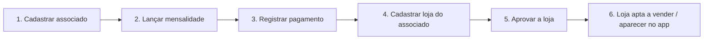
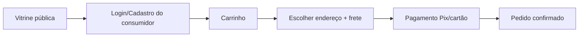

# Como Usar o Sistema

Guia completo em duas partes: **(A) instalação e execução** (para desenvolvedores) e
**(B) operação do sistema** (para o administrador da associação e demais perfis).

---

# Parte A — Instalação e Execução

## Visão geral

O projeto tem duas aplicações:

- `frontend/` — painel web administrativo (React + Vite).
- `backend/` — API REST com autenticação, regras de negócio e PostgreSQL (Prisma).

## Requisitos

- Node.js 20+ e npm 10+
- PostgreSQL (local ou em nuvem, ex.: Render)

## 1. Subir o backend

No diretório [backend](../backend):

```bash
npm install
cp .env.example .env   # configure DATABASE_URL e JWT_SEGREDO
npm run preparar
npm run dev
```

Variáveis de ambiente:

| Variável | Obrigatória | Padrão | Descrição |
|---|---|---|---|
| `DATABASE_URL` | sim | — | String de conexão PostgreSQL |
| `JWT_SEGREDO` | sim | — | Segredo do JWT (mín. 8 caracteres) |
| `PORTA` | não | `3333` | Porta da API |
| `HOST` | não | `0.0.0.0` | Host de bind |
| `ORIGEM_PERMITIDA` | não | `http://localhost:5173` | Origens do CORS (separadas por vírgula) |
| `ADMIN_EMAIL_PADRAO` | não | `admin@pescadores.local` | E-mail do admin do seed |
| `ADMIN_SENHA_PADRAO` | não | `admin123` | Senha do admin do seed |
| `ADMIN_NOME_PADRAO` | não | `Administrador` | Nome do admin do seed |

`npm run preparar` gera o client do Prisma, aplica migrações e popula o banco (admin + dados de
demonstração). Depois `npm run dev` sobe a API em `http://localhost:3333`.

## 2. Subir o frontend

No diretório [frontend](../frontend):

```bash
npm install
npm run dev
```

O painel abre em `http://localhost:5173`. Se a API estiver em outra URL, crie `frontend/.env` com:

```bash
VITE_API_URL=http://localhost:3333
```

## 3. Rodar os testes (backend)

```bash
cd backend && npm test
```

Os testes são derivados dos critérios de aceitação das specs (ver [`specs/`](../specs/README.md)).

---

# Parte B — Operando o Sistema (Painel Administrativo)

## Login

Acesse o painel e entre com as credenciais do administrador (seed padrão):

- **E-mail:** `admin@pescadores.local`
- **Senha:** `admin123`

Após o login, o token JWT é guardado no navegador e todas as telas protegidas ficam disponíveis.
Sessão expirada redireciona automaticamente para o login.

## Mapa de telas

| Tela | Para que serve |
|---|---|
| **Dashboard** | Indicadores em tempo real (associados ativos, inadimplentes, lojas aprovadas/pendentes) |
| **Associados** | Cadastro, edição e controle de status dos pescadores |
| **Lojas** | Aprovação/rejeição/suspensão de lojas |
| **Mensalidades** | Lançamento de cobranças e baixa de pagamentos |
| **Permissões** | Permissões de venda por associado (cotas e vigências) |
| **Reuniões** | Agendamento de assembleias e registro de presença |

## Fluxo recomendado (primeiro uso)



### 1. Cadastrar um associado

Tela **Associados → Novo**. Informe nome, CPF, e-mail, telefone e número da carteira (campos
únicos — o sistema valida o CPF e recusa duplicatas). O associado nasce com status `ativo`.

> O telefone é armazenado só com dígitos (a normalização é automática), o que permite a busca
> pelo chatbot em qualquer formato.

### 2. Controlar o status do associado

Na tela **Associados**, use a ação de status. As transições `suspenso` e `bloqueado` **exigem um
motivo**. Já `inadimplente`/`ativo` são geridos **automaticamente** pelas mensalidades — você não
precisa alterá-los na mão. Estados `suspenso`/`bloqueado` são **protegidos**: um pagamento não os
reverte (ver [SPEC-001](../specs/001-ciclo-vida-associado/spec.md)).

### 3. Lançar e receber mensalidades

Tela **Mensalidades**. Lance uma cobrança por **competência** (ex.: `2026-07`) com valor e
vencimento — não é possível repetir competência para o mesmo associado. Ao registrar o pagamento,
o status financeiro é recalculado na hora:

- Mensalidade vencida sem pagamento ⇒ associado vira **inadimplente** (perde elegibilidade).
- Quitação dos débitos ⇒ associado volta a **ativo**.

Há também a sincronização em lote (corrige atrasos acumulados de todos de uma vez).

### 4–5. Cadastrar e aprovar lojas

Tela **Lojas**. Uma loja nasce `pendente`. Para **aprovar**, o associado dono precisa estar
`ativo` — caso contrário o sistema recusa. Ao **rejeitar**, é obrigatório informar o motivo.
Ao aprovar, a data de aprovação é registrada; ao suspender, ela é zerada
(ver [SPEC-003](../specs/003-aprovacao-loja/spec.md)).

Somente lojas **aprovadas** de associados **ativos** podem ter produtos cadastrados e vendas
registradas.

### 6. Permissões e reuniões

- **Permissões:** habilite/desabilite permissões de venda por associado, com cota e vigência.
  Só associado `ativo` pode ter permissão `ativa`.
- **Reuniões:** agende assembleias, defina pauta e marque presença dos associados.

## Transparência (auditoria)

Ações críticas (aprovação/rejeição de loja, mudança de status, cadastro via chatbot) geram um
registro de auditoria imutável, acessível pela API (`/api/auditoria`).

---

# Parte C — Integração Externa (Chatbot & Apps)

Sistemas externos consomem a **API pública** de leitura (sem autenticação, dados mínimos):

- `GET /api/publico/associados/ativos`
- `GET /api/publico/lojas/aprovadas`
- `GET /api/publico/pescador/:id/ativo` · `/pode-vender` · `/status`
- `GET /api/publico/pescador/telefone/:telefone/ativo` · `/pode-vender` *(chatbot)*
- `GET /api/publico/loja/:id/ativa`

Os retornos são enxutos para **não** expor CPF, e-mail ou dados sensíveis. As variantes por
telefone aceitam o número em qualquer formato — o servidor normaliza antes da busca.

### Cadastro de produto pelo WhatsApp

O único endpoint público de **escrita** é `POST /api/publico/pescador/telefone/:tel/produto`.
O pescador precisa estar `ativo` e ter loja `aprovada`. Se tiver mais de uma loja aprovada, o
`lojaId` é obrigatório. Detalhes e contrato em [SPEC-005](../specs/005-api-publica-chatbot/spec.md)
e em [API.md](API.md).

---

# Parte D — App de Delivery (Consumidor)

O app do consumidor final tem autenticação própria (JWT `tipo: consumidor`) e fluxo separado do
painel:



- A **vitrine** (`GET /api/app/vitrine`) é pública e mostra só produtos disponíveis (loja aprovada,
  associado ativo, produto ativo).
- O **pedido** valida estoque e recalcula o total no backend; o frete vem do cálculo de
  `GET /api/app-frete/calcular`.
- O **pagamento** está em modo de demonstração (stub) — a integração com gateway real é o próximo
  passo antes de produção (ver [SPEC-006](../specs/006-pedidos-app-delivery/spec.md)).

---

## Dados importantes para demonstração

- Banco PostgreSQL configurado via `DATABASE_URL` (mesmo schema para dev e produção).
- Em produção (ex.: Render), use a *External Database URL* do banco provisionado.
- O seed cria o admin padrão e dados de exemplo para navegar imediatamente.
