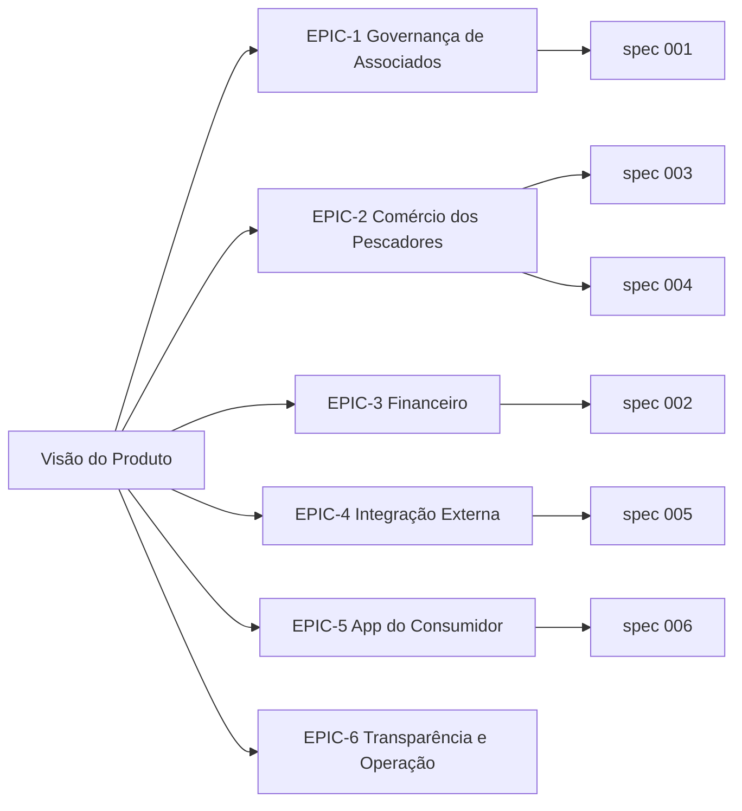

# Épicos e Histórias de Usuário

Este documento organiza o produto em **épicos** (grandes blocos de valor) desdobrados em
**histórias de usuário** (formato ágil). Cada história aponta para a *spec* do
[GitHub Spec Kit](https://github.com/github/spec-kit) que a formaliza em `specs/` e para os
testes que a validam. É a ponte entre a visão de negócio e o *Spec-Driven Development*.

## Personas

| Persona | Descrição | Acesso |
|---|---|---|
| **Administrador** | Gestor da associação; opera o painel web | Login JWT (`papel = ADMIN`) |
| **Associado (Pescador)** | Dono de loja; cadastra produtos (painel ou WhatsApp) | Via admin e chatbot |
| **Consumidor** | Cliente final que compra no app de delivery | Login JWT (`tipo = consumidor`) |
| **Sistema Externo** | Chatbot WhatsApp / marketplace que consome a API pública | API pública sem auth |

---

## EPIC-1 — Governança de Associados

**Objetivo:** manter o cadastro dos pescadores e controlar sua elegibilidade comercial ao longo
do tempo. É o núcleo do sistema — todo o resto depende do status do associado.

**Valor de negócio:** garante que apenas pescadores regulares comercializem, protegendo a
reputação da associação.

| ID | História de Usuário | Prioridade | Spec | Critérios de aceitação |
|---|---|---|---|---|
| US-1.1 | Como **admin**, quero cadastrar/editar associados com seus dados (CPF, telefone, carteira), para manter o registro oficial. | P1 | — | CPF/telefone/carteira únicos; validação de CPF |
| US-1.2 | Como **admin**, quero suspender/bloquear um associado com motivo, para aplicar sanções formais. | P1 | [001](../specs/001-ciclo-vida-associado/spec.md) | FR-002, FR-003, FR-007 |
| US-1.3 | Como **sistema**, quero rebaixar/promover o status automaticamente conforme a inadimplência, para refletir a realidade sem ação manual. | P1 | [001](../specs/001-ciclo-vida-associado/spec.md), [002](../specs/002-inadimplencia-mensalidades/spec.md) | FR-004, FR-005 |
| US-1.4 | Como **admin**, quero que sanções manuais não sejam desfeitas por um pagamento, para preservar minhas decisões. | P2 | [001](../specs/001-ciclo-vida-associado/spec.md) | FR-006 |
| US-1.5 | Como **admin**, quero consultar o histórico de status de um associado, para auditar mudanças. | P2 | [001](../specs/001-ciclo-vida-associado/spec.md) | FR-007 |

---

## EPIC-2 — Comércio dos Pescadores

**Objetivo:** permitir que pescadores aptos vendam seus produtos por meio de lojas aprovadas, com
controle de estoque confiável.

**Valor de negócio:** transforma a associação em plataforma comercial mantendo integridade de
estoque e elegibilidade.

| ID | História de Usuário | Prioridade | Spec | Critérios de aceitação |
|---|---|---|---|---|
| US-2.1 | Como **admin**, quero aprovar/rejeitar lojas (com motivo), para liberar apenas pescadores aptos. | P1 | [003](../specs/003-aprovacao-loja/spec.md) | FR-002, FR-003, FR-004 |
| US-2.2 | Como **sistema**, quero permitir produtos/vendas só em loja aprovada de associado ativo, para impedir comércio irregular. | P1 | [003](../specs/003-aprovacao-loja/spec.md) | FR-007, FR-008 |
| US-2.3 | Como **operador**, quero registrar vendas que abatem o estoque atomicamente, para nunca vender o que não existe. | P1 | [004](../specs/004-estoque-vendas/spec.md) | FR-001, FR-006, FR-007 |
| US-2.4 | Como **sistema**, quero controlar concorrência nas vendas, para não corromper o estoque em operações simultâneas. | P2 | [004](../specs/004-estoque-vendas/spec.md) | FR-009 |
| US-2.5 | Como **admin**, quero acompanhar transportes/entregas das vendas, para dar visibilidade logística. | P3 | — | Módulo `transportes` |

---

## EPIC-3 — Gestão Financeira (Mensalidades)

**Objetivo:** controlar as contribuições dos associados e automatizar a inadimplência.

**Valor de negócio:** sustenta financeiramente a associação e alimenta a regra de elegibilidade.

| ID | História de Usuário | Prioridade | Spec | Critérios de aceitação |
|---|---|---|---|---|
| US-3.1 | Como **admin**, quero lançar mensalidades por competência e registrar pagamentos, para controlar a arrecadação. | P1 | [002](../specs/002-inadimplencia-mensalidades/spec.md) | FR-001, FR-008 |
| US-3.2 | Como **sistema**, quero derivar o status da mensalidade (pago/pendente/atrasado) de forma determinística, para consistência. | P2 | [002](../specs/002-inadimplencia-mensalidades/spec.md) | FR-002 |
| US-3.3 | Como **admin**, quero um gatilho de sincronização em lote, para corrigir atrasos acumulados de uma vez. | P3 | [002](../specs/002-inadimplencia-mensalidades/spec.md) | FR-009 |

---

## EPIC-4 — Integração Externa (Chatbot & Marketplace)

**Objetivo:** expor dados e operações mínimas para sistemas de terceiros, com segurança de dados.

**Valor de negócio:** permite que o pescador cadastre produtos pelo WhatsApp e que apps externos
consultem elegibilidade sem acesso ao painel.

| ID | História de Usuário | Prioridade | Spec | Critérios de aceitação |
|---|---|---|---|---|
| US-4.1 | Como **pescador**, quero cadastrar um produto mandando mensagem no WhatsApp, para publicar sem entrar no painel. | P1 | [005](../specs/005-api-publica-chatbot/spec.md) | FR-007, FR-009, FR-010, FR-011 |
| US-4.2 | Como **sistema externo**, quero consultar se um pescador/loja está ativo sem receber dados sensíveis, para respeitar a LGPD. | P1 | [005](../specs/005-api-publica-chatbot/spec.md) | FR-001, FR-002, FR-003 |
| US-4.3 | Como **chatbot**, quero identificar o pescador pelo telefone em qualquer formato, para não depender de máscara. | P2 | [005](../specs/005-api-publica-chatbot/spec.md) | FR-005, FR-006 |

---

## EPIC-5 — App do Consumidor (Delivery)

**Objetivo:** dar ao consumidor final uma jornada de compra (vitrine → pedido → pagamento) separada
do painel administrativo.

**Valor de negócio:** abre o canal de venda direta ao consumidor.

| ID | História de Usuário | Prioridade | Spec | Critérios de aceitação |
|---|---|---|---|---|
| US-5.1 | Como **consumidor**, quero navegar uma vitrine só com produtos disponíveis, para não pedir o indisponível. | P1 | [006](../specs/006-pedidos-app-delivery/spec.md) | FR-003 |
| US-5.2 | Como **consumidor**, quero fazer um pedido com estoque e valores corretos, para comprar com segurança. | P1 | [006](../specs/006-pedidos-app-delivery/spec.md) | FR-004, FR-005, FR-006, FR-007 |
| US-5.3 | Como **consumidor**, quero gerenciar endereços (um principal) e pagar via Pix/cartão, para concluir a compra. | P2 | [006](../specs/006-pedidos-app-delivery/spec.md) | FR-008, FR-009, FR-010 |

---

## EPIC-6 — Transparência e Operação

**Objetivo:** dar visão gerencial e rastreabilidade das ações críticas.

**Valor de negócio:** transparência administrativa e apoio à tomada de decisão.

| ID | História de Usuário | Prioridade | Spec | Critérios de aceitação |
|---|---|---|---|---|
| US-6.1 | Como **admin**, quero um dashboard com indicadores (ativos, inadimplentes, lojas), para acompanhar a associação. | P1 | — | Módulo `dashboard` |
| US-6.2 | Como **admin**, quero registrar reuniões e presenças, para documentar as assembleias. | P2 | — | Módulo `reunioes` |
| US-6.3 | Como **admin**, quero um log de auditoria imutável das ações críticas, para transparência. | P2 | Transversal | `LogAuditoria` |
| US-6.4 | Como **admin**, quero controlar permissões de venda por associado, para gerir cotas e vigências. | P2 | [001](../specs/001-ciclo-vida-associado/spec.md) | FR-009 |

---

## Rastreabilidade Épico → Spec → Teste

| Épico | Specs | Testes |
|---|---|---|
| EPIC-1 | 001 | `SPEC-001-validacao-associado.test.ts` |
| EPIC-2 | 003, 004 | `SPEC-004-calculo-frete.test.ts`, `SPEC-004-estoque-vendas.test.ts` |
| EPIC-3 | 002 | `SPEC-002-inadimplencia.test.ts` |
| EPIC-4 | 005 | `SPEC-005-normalizacao-telefone.test.ts` |
| EPIC-5 | 006 | `SPEC-006-pedidos-app.test.ts` |
| EPIC-6 | transversal | auditoria integrada aos fluxos acima |

> Épicos sem spec dedicada (dashboard, reuniões, transportes) são CRUDs operacionais cobertos pela
> arquitetura modular padrão; as regras *não triviais* é que viram spec formal.
